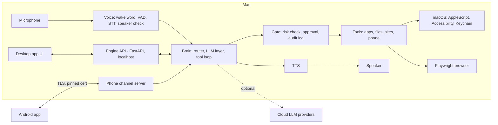

# Architecture

## 1. Overview

Ela has three parts: a **desktop app** (UI shell), a local **engine** (Python, does all the work) and an **Android companion**. The engine is the only component that touches the Mac, the network and the models.

## 2. Components

### Desktop app
- Menu bar presence, onboarding, settings, conversation view, approval prompts.
- Talks to the engine over `http://127.0.0.1` and a WebSocket. No external network.
- UI: frosted-glass design language, light and dark.

### Engine (Python 3.11+)
| Module | Responsibility |
|---|---|
| `voice/` | Wake word (openWakeWord), VAD (Silero), STT (faster-whisper / whisper.cpp), TTS (Piper), speaker verification (Resemblyzer or SpeechBrain) |
| `brain/router.py` | Pattern and embedding-free intent matching for simple commands |
| `brain/llm.py` | LiteLLM wrapper, provider chain, sensitivity policy, redaction |
| `brain/loop.py` | Tool-calling loop with step limit and cancellation |
| `tools/` | One module per tool with JSON schema and risk level |
| `gate/` | Risk evaluation, approval requests (Touch ID via LocalAuthentication), audit log |
| `sites/` | Site manager, Playwright sessions, request interception |
| `phone/` | Pairing, TLS server, message handling, file transfer |
| `config/` | YAML config, Keychain access (`keyring`), paths |

### Android app (Flutter)
- QR pairing, voice capture and streaming, file inbox, approval notifications, status.

## 3. Data flow: a typical command

1. Wake word fires. VAD records until silence.
2. Speaker verification checks the voice. If it fails, log and stop.
3. STT produces a transcript (local).
4. Router tries to match a tool. If matched, go to step 7.
5. Otherwise the LLM layer tags the task sensitive or not, redacts, and picks a provider per policy.
6. The model returns a tool call (or a plain answer).
7. Gate looks up the tool's risk level. R0/R1 run. R2 follows policy. R3 always asks for approval.
8. Tool runs and returns a result. Result is logged.
9. TTS speaks the answer and the UI shows it.

## 4. Web automation flow

1. Site manager opens the persistent Playwright profile for the site.
2. If logged out, the login tool retrieves credentials from Keychain and fills the form in code.
3. If a captcha appears, Ela pauses and asks the user to solve it, then continues.
4. Request interception blocks POST/PUT/DELETE outside the login flow unless approved.
5. Page text or accessibility tree is trimmed, redacted and marked as untrusted data before any model sees it.

## 5. Technology stack

| Layer | Choice | Notes |
|---|---|---|
| Desktop shell | Electron or Tauri | Decided in Phase 0 |
| Engine | Python 3.11, FastAPI, asyncio | Bundled with py2app or PyInstaller |
| Wake word | openWakeWord | Custom "Hey Ela" model |
| VAD | Silero VAD | |
| STT | faster-whisper / whisper.cpp | `base` or `small` default |
| TTS | Piper | `say` as fallback |
| Speaker check | Resemblyzer or SpeechBrain | |
| LLM layer | LiteLLM | Ollama, Groq, Cerebras, OpenRouter, Gemini |
| Mac control | osascript, pyobjc, `shortcuts`, `mdfind` | |
| Browser | Playwright | Optional: browser-use for generic pages |
| Secrets | `keyring` | macOS Keychain |
| Storage | SQLite | Audit log, task history |
| Phone link | WebSocket + HTTPS, `zeroconf` | Tailscale optional |
| Android | Flutter | `web_socket_channel`, `mobile_scanner`, `file_picker` |
| Packaging | py2app / PyInstaller, universal2 `.dmg` | |

## 6. Configuration and storage locations

- Config: `~/Library/Application Support/Ela/config.yaml`
- Data (audit log, models): `~/Library/Application Support/Ela/`
- Browser profiles: `~/Library/Application Support/Ela/profiles/<site>/`
- Secrets: macOS Keychain, service names prefixed `com.ela.`

## 7. Error handling principles

- Every tool returns a structured result: `ok`, `data`, `error_code`, `user_message`.
- Provider failures trigger fallback; the user sees a short explanation only if all options fail.
- Long tasks are cancellable ("Ela, stop").
- The engine supervises itself and restarts after a crash.
